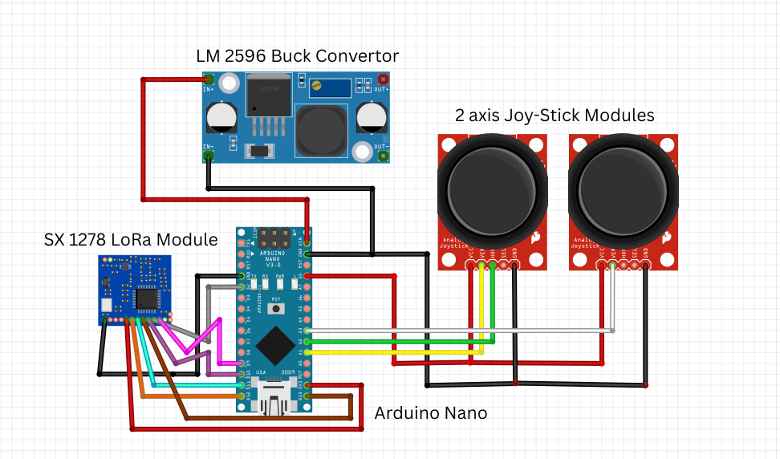
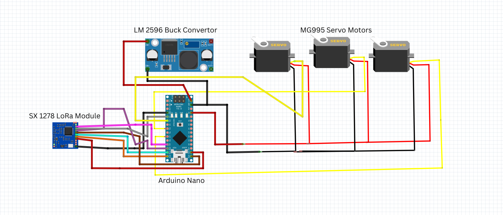
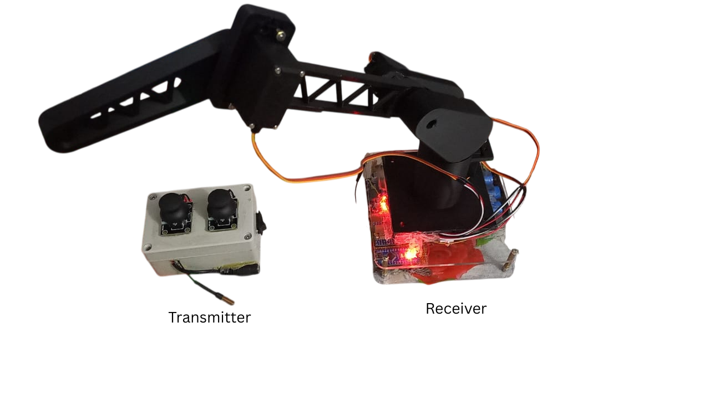

# 🎮 LoRa-Based Wireless Servo Control with Joystick (Arduino Nano)

This project demonstrates real-time wireless control of 3 servo motors using a joystick, two Arduino Nanos, and SX1278 LoRa modules.

## 🛠 Components Used
- 2x Arduino Nano
- 2x LoRa SX1278 modules (433 MHz)
- 1x Joystick module (3-axis)
- 3x MG995 Servo motors
- 1x 5V 3A Buck converter
- Capacitors: 470µF and 100nF
- Breadboards, wires, and power supply

## 🧰 How It Works
- **Transmitter**: Reads joystick X, Y, Z axes and sends data over LoRa.
- **Receiver**: Receives joystick values and maps them to servo angles to control 3 MG995 servos.

## ⚙️ Arduino Code
- [Transmitter Code](./Transmitter/transmitter.ino)
- [Receiver Code](./Receiver/receiver.ino)

## 📷 Media

## ⚠️ Challenges & Fixes
| Problem | Cause | Fix |
|--------|-------|-----|
| System freezes after one command | Blocking LoRa reads on partial packets | Buffered reading with `LoRa.available()` checks |
| Random resets during servo operation | Voltage drop due to servo current | Powered servos from buck, added capacitors |
| LoRa module unresponsive after servo spikes | Electrical noise from MG995 | Added filtering caps & separated power rails |

## 📚 Learnings
- Importance of power decoupling in embedded systems
- Managing current-hungry components like MG995
- Writing robust, non-blocking communication code

## 💡 Future Improvements
- Add failsafe timeout on lost signal
- Implement OLED status display
- Integrate power monitoring

